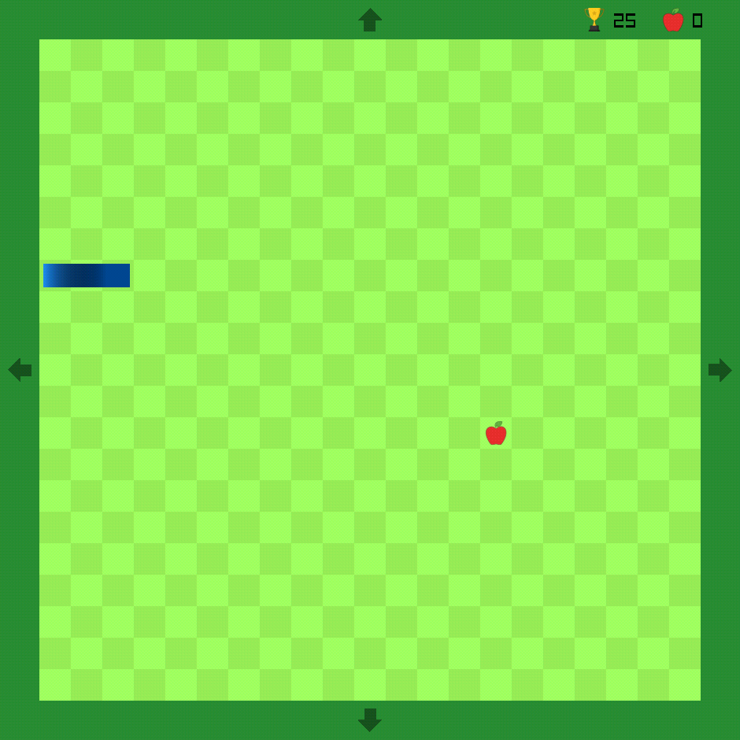
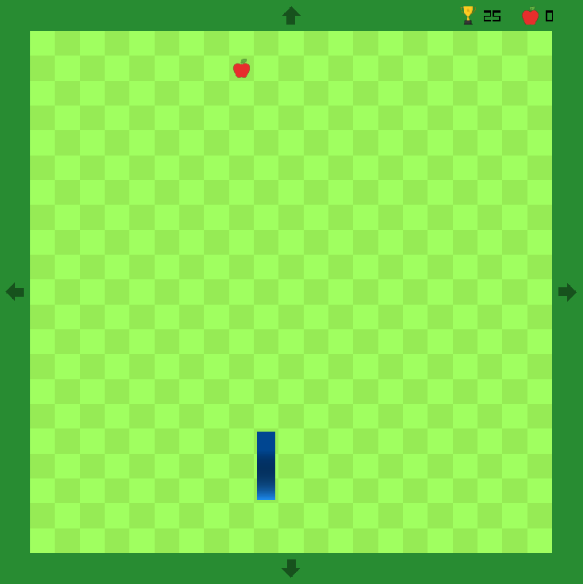
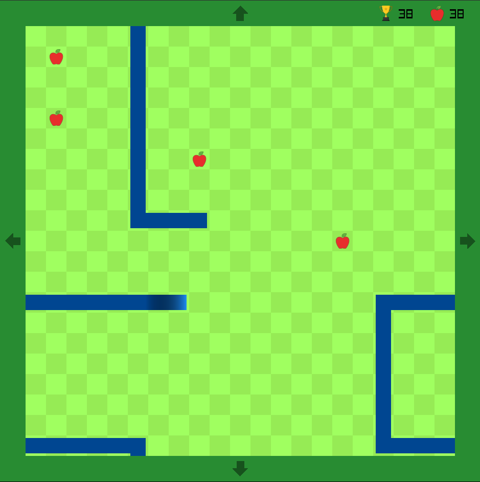

# raylib-projects

this is a repository for the projects I make using raylib,
all in one repository to not create too many separate repositories.

each branch is a separate project, but sometimes I also make a temporary branch
to test stuff and/or add stuff to another branches without flooding the commit history.

current projects I'm working on:

* [tic-tac-toe](https://github.com/JohnnyCena123/raylib-projects/tree/tic-tac-toe)
  * [latest development build](https://github.com/JohnnyCena123/raylib-projects/releases/tag/nightly-tic-tac-toe)
  * [built binaries](https://github.com/JohnnyCena123/raylib-projects/releases/tag/TicTacToe-v1.0.0)
* [snake](https://github.com/JohnnyCena123/raylib-projects/tree/snake)
  * [latest development build](https://github.com/JohnnyCena123/raylib-projects/releases/tag/nightly-snake)
  * [built binaries](https://github.com/JohnnyCena123/raylib-projects/releases/tag/Snake-v1.0.0)

more info about each branch can be found in its own `README.md`.

## about this branch

this branch is a template I use whenever I want to start a new project. \
e.g. I'm starting to work on a new game, so I just copy this branch and
hop right into coding.

some media:

<!-- thanks chatgpt, i wouldntve wanted to learn html myself -->
<!-- and its not me who knows how to make comments - its ctrl+/ in vscode -->
<table border=0 cellspacing=0 cellpadding=0 style="border-collapse:collapse;">
  <tr>
    <td rowspan=2 valign="top"></td>
    <td valign="top"></td>
  </tr>
  <tr>
    <td valign="top"></td>
  </tr>
</table>

## installing

there are 4 options for installing the projects in this repository.

1. downloading from the latest release of each one (currently there are such only for
  [tic-tac-toe](https://github.com/JohnnyCena123/raylib-projects/releases/tag/TicTacToe-v1.0.0) and
  [snake](https://github.com/JohnnyCena123/raylib-projects/releases/tag/Snake-v1.0.0))
2. downloading from the development build of the latest commit, e.g.
  [snake](github.com/JohnnyCena123/raylib-projects/releases/tag/nightly-snake)
3. downloading CI artifacts - practically the same as getting them from nightly releases.
4. [building from source](#building)

### portable mode

if you want the software to run in portable mode, you can either pass the `-DPORTABLE=ON`
flag to cmake when building, or simply add a `.portable` file besides the executable - in the same directory.
the folder structure should look like this:

```theres-no-language-for-this-really-so-stop-warning-me-markdown-lint
/path/to/installed/project/
├── .portable               -- if it was not already built with the portable cmake flag
├── <executable>            -- the executable - .exe, ELF, etc.
├── <libraries...>          -- shared libaries - e.g. libraylib.dll, libimgui.so, ...
└── resources/              -- resources directory
   └── <resources...>       -- resource - images, sounds, fonts, etc.
```

### notes

on windows, the executable will not spawn a terminal by default, unless you pass a flag to it that implies it needs to do that,
or simply pass `-` as an argument. don't ask why, but yeah

## building

the project can be built as usual like any other cmake project:

```bash
git clone https://github.com/JohnnyCena123/raylib-projects
cd raylib-projects
git checkout <branch - project>
cmake -Bbuild -S. <optional flags - see below> -DCMAKE_BUILD_TYPE=<build type>
cmake --build build --config <build type>
```

optional flags you can use when building:

* `-DBUILD_SHARED_LIBS=ON` - build static/shared libraries, and adjust to each mode
* `-DUSE_CACHING_COMPILER=OFF` - disables looking for ccache/sccache when configuring the project
* `-DALL_BUILD_TYPES_TOGETHER=OFF` - places the output of each build type in its own separate directory
* `-DLOCAL_CMAKE_BUILD=ON` - various optimizations for building locally
* `-DCUSTOM_OUTPUT_OPTIONS=ON` - don't use the default output options specified by this project
  * `-DCMAKE_RUNTIME_OUTPUT_DIRECTORY=/path/to/output/directory` - specifies where the output executable will be
  * `-DBIN_SUFFIX=-foobar` - suffix for the filename of the output executable
* `-DDISABLE_WARNINGS=OFF` - disables disabling warnings for dependencies
* `-DIMGUI_IN_RELEASE=ON` - keep imgui debug windows in release mode
* `-DINCLUDE_TERMINAL_IN_RELEASE=ON` - include the terminal popup when building for windows in release mode
* `-DINCLUDE_ICON=OFF` - turn on/off the desktop icon on windows
* `-DUSE_PRECOMPILED_HEADERS=OFF` - pre-compiled headers before the rest of the code
* `-DPORTABLE=ON` - build in portable mode, i.e. everything in 1 folder

### notes

* it is recommended to set the `CPM_SOURCE_CACHE` environment variable to a directory where dependency repositories will be cached. \
  for example, raylib is relatively big (400mb) so you wouldn't want to re-clone it every time when rebuilding the project, \
  or building a different project that uses [CPM.cmake](https://github.com/cpm-cmake/CPM.cmake) too.

## contributions

I am not actively looking for contributors. however, if you find in my code:

* a bug
* some part that is really messy/unreadable
* any sort of bad practice I'm using

feel free to contact me - either by opening an issue on this repository,
or messaging me on discord (`@johnnycena123`). \
or if you really want, you could open a pull request.

# known bugs

* nothing in this repository is thread-safe whatsoever.

## credits

the music used in this project is provided by <https://sunixdev.itch.io/casual-music-pack> under the CC BY 4.0 license.

## license

this project is licensed under the [LGPLv3.0 license](./LICENSE).
