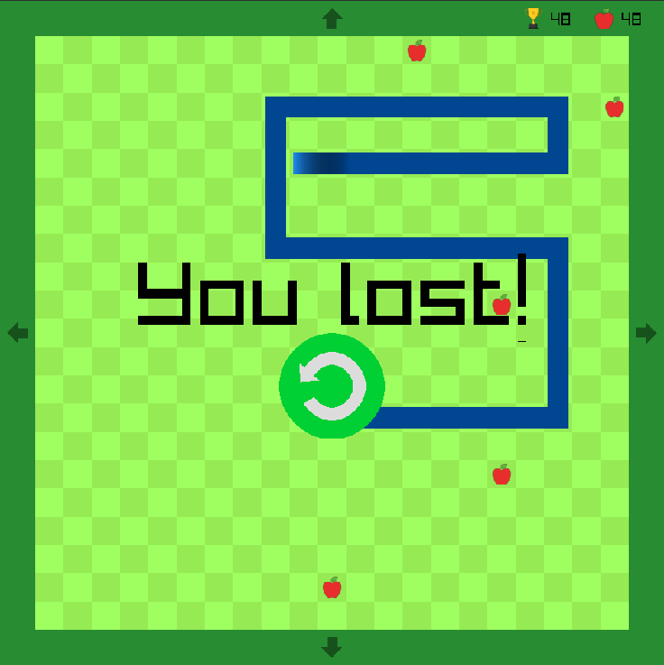

# Snake

This is where I am making my second project, a Snake game!

## About this branch

### Current features

* Wrapping around the screen when you hit a border, instead of dying \
  (which is more fun, I think)
* Restarting the game when you lose
* Score and high-score (with the high-score being the best score you got within the same save file)
* Another apple is being added once every 10 points
* The snake speeds up by 1/3m/s/point
* Amazing visuals (in my opinion)
* Extensive debug window on non-Release builds using [Dear ImGui](https://github.com/ocornut/imgui)

### Planned for the future

* Main menu with settings
* Escape menu with real time configurations
* Visual customization (theme, style, etc.)
* More game-modes
* Multiplayer - potentially offline or online, either way I wouldn't say that it's coming 'soon'

### Media




## Installing

There are 4 options for installing the projects in this repository.

1. Downloading from the latest release of each one (currently there are such only for
  [Tic Tac Toe](https://github.com/JohnnyCena123/raylib-projects/releases/tag/TicTacToe-v1.0.0) and
  [Snake](https://github.com/JohnnyCena123/raylib-projects/releases/tag/Snake-v1.0.0))
2. Downloading from the development build of the latest commit, e.g.
  [snake](github.com/JohnnyCena123/raylib-projects/releases/tag/nightly-snake)
3. Downloading CI artifacts - practically the same as getting them from nightly releases.
4. [Building from source](#building)

### Portable mode

If you want the application to run in portable mode, you can either pass the `-DBUILD_PORTABLE_APPLICATION=ON`
flag to CMake when building, or simply add a `.portable-application` file besides the executable - in the same directory.
The folder structure should look like this:

```theres-no-language-for-this-really-so-stop-warning-me-markdown-lint
/path/to/installed/project/
├── .portable-application   -- if it was not already built with the portable CMake flag
├── <Executable>            -- the actual application
├── <libraries...>          -- shared libaries - e.g. libraylib.dll, libimgui.so, ...
└── resources/              -- resources directory
   └── <resources...>       -- resource - images, sounds, fonts, etc.
```

### Notes

On windows, the app will not spawn a terminal by default, unless you pass a flag to it that implies it needs to do that,
or simply pass `-` as an argument. don't ask why, but yeah

## Building

The project can be built as usual like any other CMake project:

```bash
git clone https://github.com/JohnnyCena123/raylib-projects
cd raylib-projects
git checkout Snake
cmake -Bbuild -S. <optional flags - see below> -DCMAKE_BUILD_TYPE=<build type>
cmake --build build --config <build type>
```

Optional flags you can use when building:

* `-DBUILD_SHARED_LIBS=ON` - Built-into CMake, at its core just makes CMake's `add_library()` function default to
  shared (dynamic) libraries instead of static libraries when none are specified. In this project, though, it also
  adds a suffix to dependencies' shared libraries in non-Release builds, e.g.
  `libraylib.so --> libraylib-RelWithDebInfo.so`, allowing everything to be in one folder.
* `-DUSE_CACHING_COMPILER=OFF` - Disables looking for ccache/sccache when configuring the project.
* `-DALL_BUILD_TYPES_TOGETHER=OFF` - Places the output of each build type in its own separate directory.
* `-DLOCAL_CMAKE_BUILD=ON` - Enables options for building locally.
  Mainly helps with organizing builds of different build types or different projects.
* `-DCUSTOM_OUTPUT_OPTIONS` - Allows you to specify the Executable name, and/or build output directory; or disable them
  completely, and let CMake use the default values for them.
  * `-DCMAKE_RUNTIME_OUTPUT_DIRECTORY=/path/to/output/directory` - Built-into CMake,
    allows you to specify where the output Executable will be.
  * `-DBIN_SUFFIX=-foobar` - Specifies the suffix for the filename of the output Executable
* `-DDISABLE_WARNINGS=OFF` - Disables disabling warnings for dependencies.
* `-DIMGUI_IN_RELEASE=ON` - Keep ImGui debug windows in Release mode
* `-DINCLUDE_TERMINAL_IN_RELEASE=ON` - Allows you to include the terminal popup when building for Windows in Release mode.
* `-DINCLUDE_ICON=OFF` - Lets you decide whether or not the application will have a taskbar/explorer icon on Windows.
* `-DUSE_PRECOMPILED_HEADERS=OFF` - Whether or not project headers will be pre-compiled before the rest of the code.
* `-DBUILD_PORTABLE_APPLICATION=ON` - Determines whether the application should be built in portable mode,
  i.e. everything in 1 folder
* `-DSHOW_TILE_NUMBERS=ON` - Show tile numbers on the snake
* `-DVERBOSE_LOGGING` - Logs a bunch of seemingly useless stuff. Used for debugging

### Notes

* It is recommended to set the CPM_SOURCE_CACHE environment variable to a directory where dependency repositories will be cached. \
  For example, raylib is relatively big (400mb) so you wouldn't want to re-clone it every time when rebuilding the project, \
  or building a different project that uses [CPM.cmake](https://github.com/cpm-cmake/CPM.cmake) too.
* If you use `CPack` to package the built application, make sure to first __build__ the project (not just configure, __build__!) - \
  otherwise you will not have proper description for the package, as the description is generated by running the \
  executable itself, which can only happen at post-build time.

## Contributions

I am not actively looking for contributors, however, if you find in my code:

* A bug
* Some part that is really messy/unreadable
* Any sort of bad practice I'm using
Feel free to contact me - either by opening an issue on this repository,
or messaging me on Discord (`@johnnycena123`). \
Or if you really want, you could open a pull request :)

## Credits

The music used in this project is provided by <https://sunixdev.itch.io/casual-music-pack> under the CC BY 4.0 license.

## License

This project is licensed under the [LGPLv3.0 License](./LICENSE).
